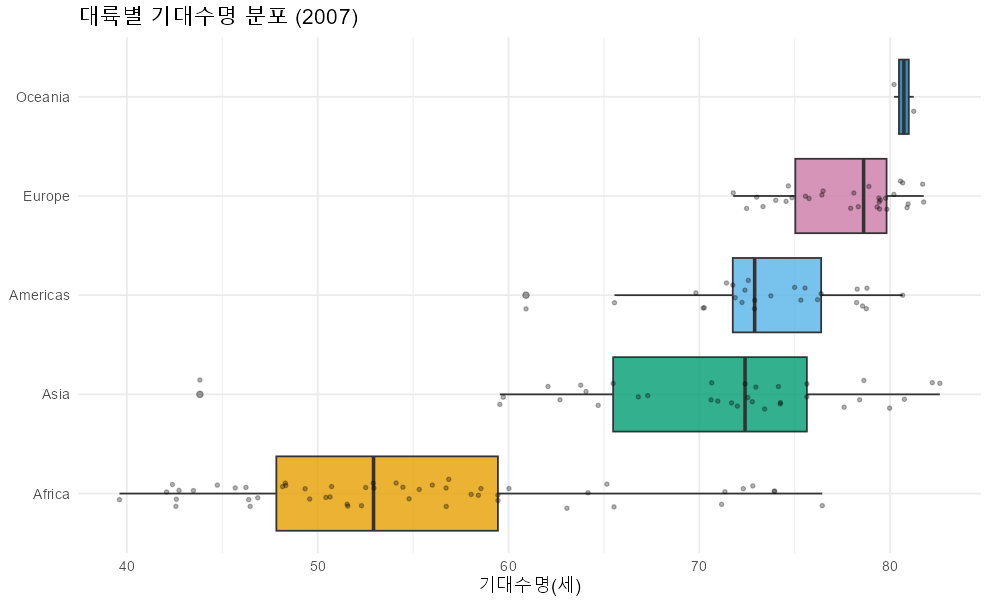
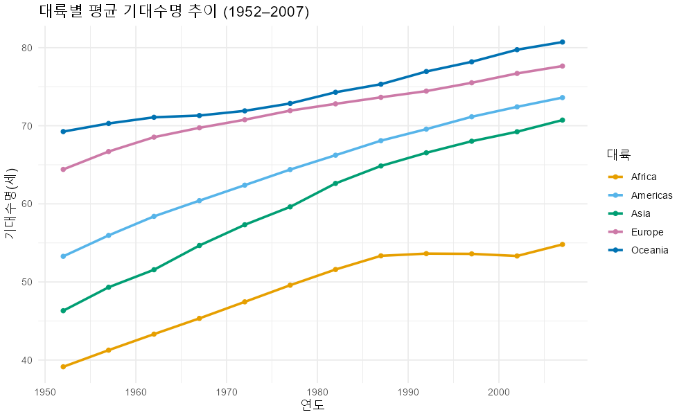
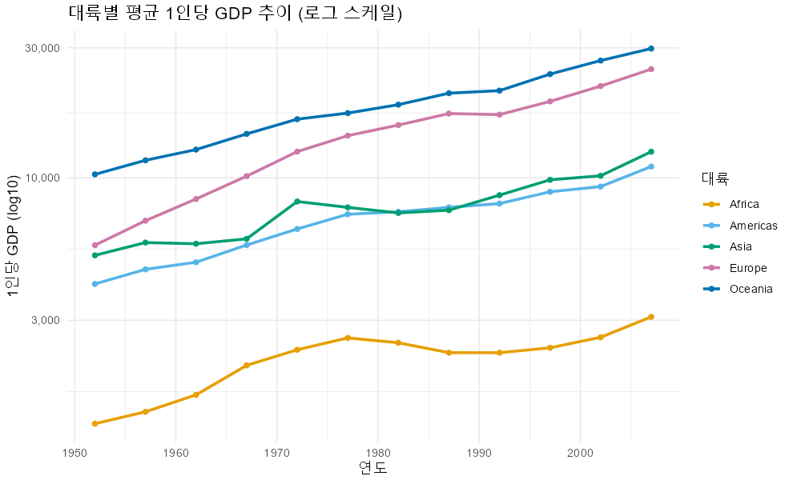
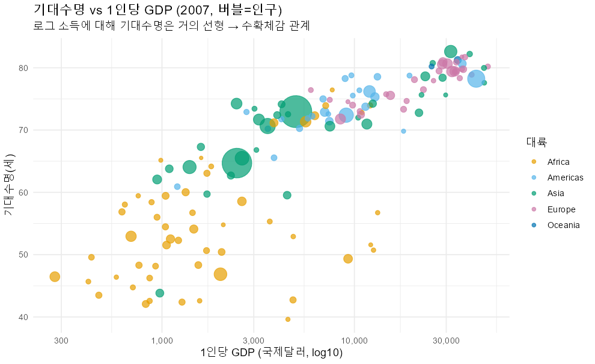
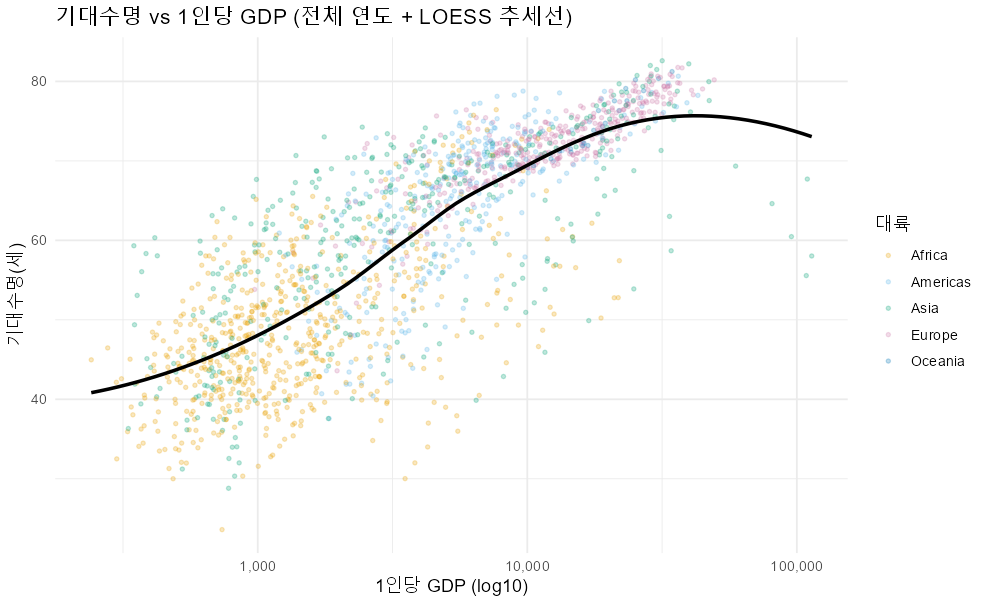
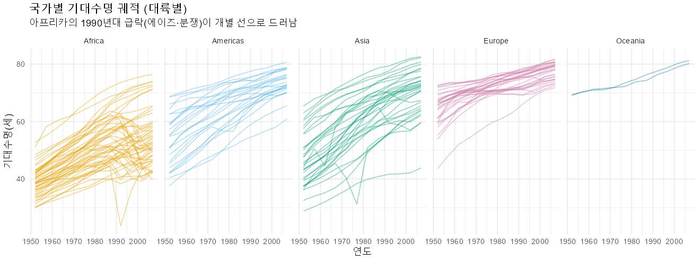

# 탐색적 데이터 분석 보고서 (EDA Report)

- **대상 파일**: `data/gapminder.csv`
- **분석 스크립트**: [`EDA.R`](../EDA.R) (ggplot2 · dplyr · readr)
- **데이터 규모**: 1,704행 × 6열 — 142개국 × 5개 대륙 × 12개 시점(1952–2007, 5년 간격)
- **산출 차트**: [`figures/`](../figures/) 폴더 PNG 8종
- **작성 일시**: 2026-06-27

> 재현: 프로젝트 루트에서 `Rscript EDA.R` 실행 → 콘솔 요약 + `figures/` 갱신

---

## 1. 데이터 개요

수치형 변수 요약통계:

| 변수 | 최소 | 1사분위 | 중앙값 | 평균 | 3사분위 | 최대 |
|------|------|---------|--------|------|---------|------|
| lifeExp (세) | 23.60 | 48.20 | 60.71 | 59.47 | 70.85 | 82.60 |
| pop (명) | 60,011 | 279만 | 702만 | 2,960만 | 1,959만 | 13.19억 |
| gdpPercap (달러) | 241.2 | 1,202 | 3,532 | 7,215 | 9,326 | 113,523 |

**관찰**: `pop`·`gdpPercap`은 **평균 ≫ 중앙값** — 소수 극단값이 평균을 끌어올리는 우편향 구조. 반면 `lifeExp`는 평균(59.5) ≈ 중앙값(60.7)으로 비교적 대칭.

---

## 2. 단변량 분포 (Univariate)

왜도(skewness) 기반 변환 진단:

| 변수 | 왜도 | 진단 |
|------|------|------|
| lifeExp | −0.25 | 거의 대칭 (변환 불필요) |
| gdpPercap | **+3.85** | 강한 우편향 → **로그 변환 권장** |
| pop | **+8.33** | 강한 우편향 → **로그 변환 권장** |

### 기대수명 분포

전 연도를 합치면 약 40세대와 70세대 부근에 봉우리가 보이는 **이봉형(bimodal)** 경향 — 저소득(저수명)·고소득(고수명) 국가군의 공존을 시사한다.

### 1인당 GDP 분포 (로그 스케일)

원자료는 극단적 우편향이지만 **로그 변환 시 종형(정규)에 가까워진다.** 이후 모든 GDP 관련 분석에서 로그 스케일을 사용하는 근거.

---

## 3. 대륙별 분포 (2007)

기대수명 요약통계:

| 대륙 | n | 평균 | 중앙값 | 표준편차 |
|------|---|------|--------|----------|
| Africa | 52 | 54.81 | 52.93 | **9.63** |
| Americas | 25 | 73.61 | 72.90 | 4.44 |
| Asia | 33 | 70.73 | 72.40 | 7.96 |
| Europe | 30 | 77.65 | 78.61 | 2.98 |
| Oceania | 2 | 80.72 | 80.72 | 0.73 |

**관찰**: 표준편차가 대륙 내 동질성을 보여준다. 유럽·오세아니아는 좁고(동질적), **아프리카(9.63)·아시아(7.96)는 넓다(내부 격차 큼).** 박스 길이와 점 산포가 이를 시각적으로 확인시킨다.

---

## 4. 시계열 추세 (대륙 평균)

### 기대수명 추이

- 모든 대륙이 우상향하나 **후발 대륙(아시아·아프리카)의 기울기가 더 가파르다 → 수렴(catch-up).**
- **아프리카는 1990년대에 평탄·정체** — 다른 대륙과 달리 선이 꺾인다.

### 1인당 GDP 추이 (로그 스케일)

- 수명과 달리 **소득은 격차가 벌어진다(발산)** — 유럽 선이 아프리카에서 멀어진다.
- 아프리카는 1977–1992년 구간에서 오히려 하락.

---

## 5. 기대수명 vs 1인당 GDP (이변량)

상관계수:

| 구분 | 원자료 r | log(GDP) r |
|------|----------|-------------|
| 전체 | 0.584 | **0.808** |
| Africa | — | 0.535 |
| Americas | — | 0.710 |
| Asia | — | 0.689 |
| Europe | — | 0.852 |
| Oceania | — | 0.960 |

로그 변환 시 상관이 일관되게 강화 → **소득의 "비율" 증가가 수명과 연결되는 수확체감 관계.**

### 2007년 산점도 (버블 = 인구)

로그 소득축에 대해 기대수명이 **거의 직선**을 그린다. 좌하단 아프리카 군집 ↔ 우상단 유럽 군집이 뚜렷이 분리된다. 큰 버블(중국·인도)이 중간 소득대에 위치.

### 전체 연도 산점 + LOESS 추세선

1,704개 관측치 전체에서도 로그-선형 패턴이 안정적으로 유지된다. LOESS 곡선이 완만한 로그형을 그린다.

---

## 6. 국가별 궤적 (대륙 facet)

각 선은 한 국가의 55년 기대수명 경로다.
- 대부분의 국가는 꾸준히 상승한다.
- **아프리카 패널에서 1990년대에 급락하는 개별 선들**(르완다·짐바브웨·보츠와나 등 — 에이즈·분쟁)이 평균선 이면의 충격을 드러낸다.
- 아시아 패널은 출발점이 낮지만 가장 가파른 상승(추격)을 보인다.

---

## 7. 주요 발견 (Key Findings)

1. **분포 비대칭** — `gdpPercap`(왜도 3.85)·`pop`(8.33)은 강한 우편향. 통계 비교 시 **로그 변환 또는 중앙값**을 사용해야 왜곡이 없다.
2. **비선형(로그형) 관계** — 기대수명-소득 상관이 원자료 0.58에서 log(GDP) 0.81로 강화. 빈국에서 소득 개선의 한계효과가 크다(수확체감).
3. **수명은 수렴, 소득은 발산** — 대륙 간 기대수명 격차는 좁혀졌으나 경제적 격차는 벌어졌다.
4. **아프리카의 1990년대 충격** — 평균 정체의 이면에는 facet 궤적에서 드러난 개별 국가의 급락(에이즈·분쟁)이 있다.

---

## 부록 — 산출 차트 목록

| 번호 | 파일 | 설명 |
|------|------|------|
| 01 | [`01_hist_lifeExp.png`](../figures/01_hist_lifeExp.png) | 기대수명 히스토그램 |
| 02 | [`02_hist_gdp_log.png`](../figures/02_hist_gdp_log.png) | GDP 분포 (로그) |
| 03 | [`03_box_lifeExp_2007.png`](../figures/03_box_lifeExp_2007.png) | 대륙별 박스플롯 (2007) |
| 04 | [`04_trend_lifeExp.png`](../figures/04_trend_lifeExp.png) | 기대수명 시계열 |
| 05 | [`05_trend_gdp.png`](../figures/05_trend_gdp.png) | GDP 시계열 (로그) |
| 06 | [`06_scatter_2007.png`](../figures/06_scatter_2007.png) | 버블 산점도 (2007) |
| 07 | [`07_scatter_all_loess.png`](../figures/07_scatter_all_loess.png) | 전체 산점 + LOESS |
| 08 | [`08_facet_country_traj.png`](../figures/08_facet_country_traj.png) | 국가 궤적 facet |

---

*본 보고서는 `EDA.R` 실행 결과(콘솔 통계 + figures/ 차트)를 종합한 것이다. 모든 통계는 비가중 국가 평균 기준(인구 가중 아님).*
