# 탐색적 데이터 분석 보고서 (EDA Report · 개정판)

- **대상 파일**: `data/gapminder.csv`
- **분석 스크립트**: [`EDA.R`](../EDA.R) (ggplot2 · dplyr · readr)
- **데이터 규모**: 1,704행 × 6열 — 142개국 × 5개 대륙 × 12개 시점(1952–2007, 5년 간격)
- **산출**: [`figures/`](../figures/) PNG 차트 13종 + `session_info.txt`
- **작성 일시**: 2026-06-27

> **개정 동기** — 초판 EDA의 한계를 비판적으로 보완했다.
> ① 비가중 평균만 사용 → **인구가중('평균적 사람')** 관점 추가
> ② 수렴/발산을 *주장*만 함 → **σ-수렴·β-수렴**으로 정량화
> ③ 풀링이 만든 *이봉형 착시* → **연도별 분포 이동**으로 정정
> ④ 이상치를 *세기*만 함 → **소득 대비 잔차**로 이름 붙여 식별
> ⑤ 상관계수만 제시 → **선형모형 R²·연도별 상관추이** 추가
> ⑥ Oceania(n=2) 동급 취급 → **명시적 캐비엇**
> ⑦ 재현성 부재 → **set.seed(42) + sessionInfo 기록**
>
> 재현: 프로젝트 루트에서 `Rscript EDA.R`

---

## 1. 데이터 개요

| 변수 | 최소 | 1사분위 | 중앙값 | 평균 | 3사분위 | 최대 |
|------|------|---------|--------|------|---------|------|
| lifeExp (세) | 23.60 | 48.20 | 60.71 | 59.47 | 70.85 | 82.60 |
| pop (명) | 60,011 | 279만 | 702만 | 2,960만 | 1,959만 | 13.19억 |
| gdpPercap ($) | 241.2 | 1,202 | 3,532 | 7,215 | 9,326 | 113,523 |

대륙별 국가 수: Africa 52 · Americas 25 · Asia 33 · Europe 30 · **Oceania 2**.
> ⚠️ **Oceania는 호주·뉴질랜드 2개국뿐** — 대륙 내 분산통계(표준편차·IQR·박스플롯)는 해석에 주의한다.

---

## 2. 단변량 분포 — 형태 진단

| 변수 | 왜도 | 첨도 | 진단 |
|------|------|------|------|
| lifeExp | −0.25 | −1.13 | 근사 대칭 |
| gdpPercap | **+3.85** | **+27.4** | 강한 우편향 → 로그/중앙값 권장 |
| pop | **+8.33** | **+77.7** | 강한 우편향 → 로그/중앙값 권장 |

극단값: 최저 기대수명 **Rwanda 1992 (23.6세)** · 최고 1인당 GDP **Kuwait 1957 ($113,523)** — 석유경제의 단기 고소득.

| 기대수명 | 1인당 GDP (로그) |
|---|---|
| 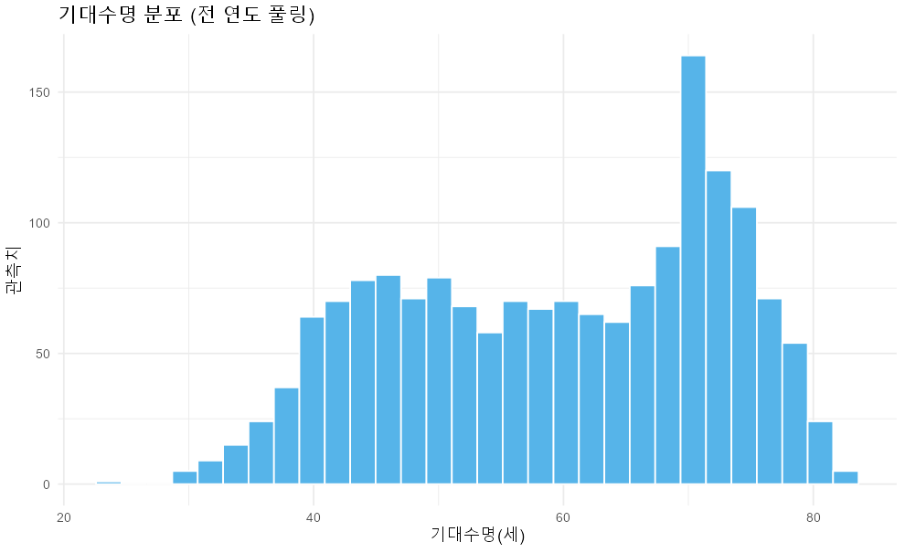 | 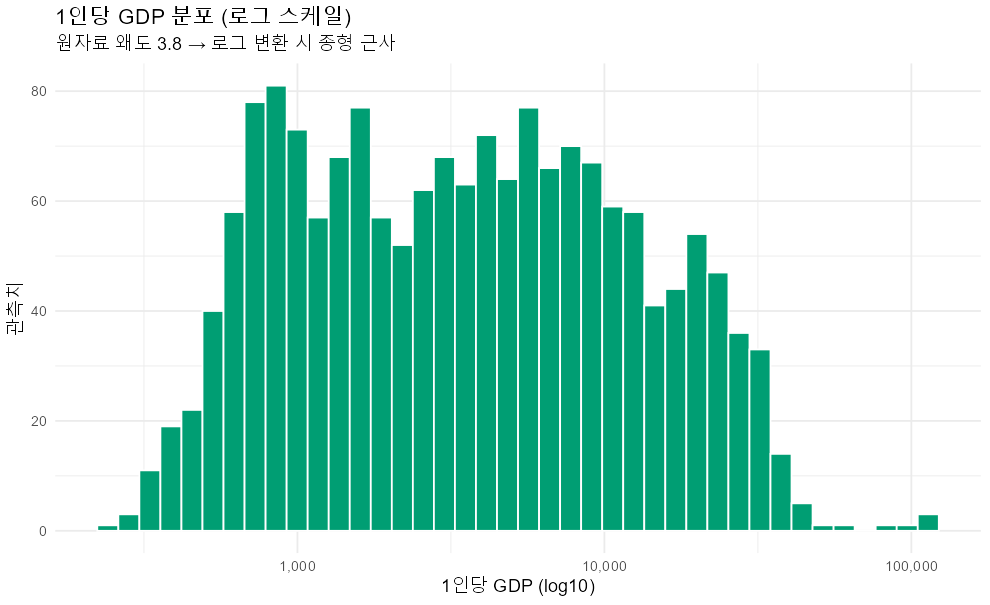 |

GDP는 원자료 왜도 3.85의 극단적 우편향이지만 로그 변환 시 종형에 근사 → 이후 모든 소득 분석에 로그 스케일 사용.

---

## 3. 분포의 시간적 이동 — '이봉형'의 정체 (보완)

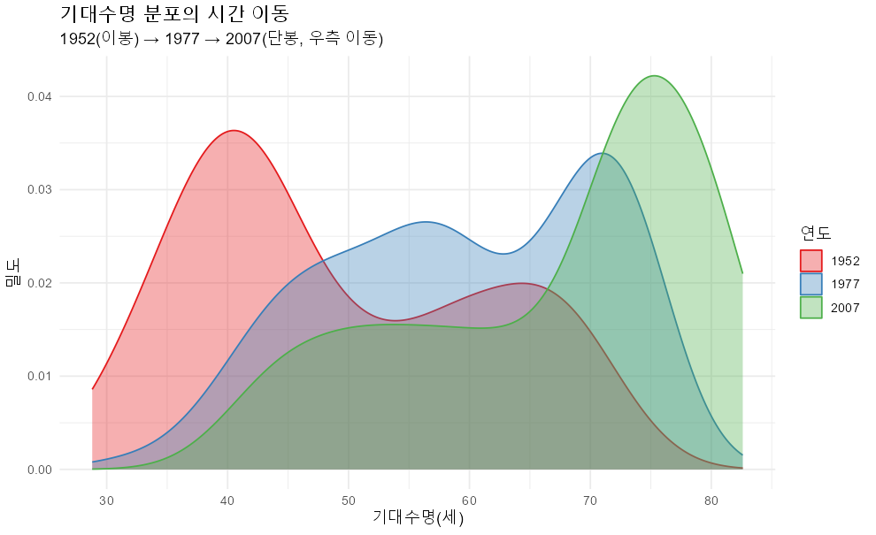

초판이 관찰한 "이봉형"은 **전 연도를 풀링해서 생긴 착시**였다. 연도를 분리해 보면, 1952년의 저수명 봉우리가 시간이 지나며 **우측(고수명)으로 이동**해 2007년에는 단봉형으로 수렴한다. 즉 "두 개의 세계"가 고정된 게 아니라 **저수명 집단이 따라잡고 있는** 동적 과정이다.

---

## 4. 대륙별 분포 (2007)

| 대륙 | n | 평균 | 중앙값 | 표준편차 | IQR |
|------|---|------|--------|----------|-----|
| Africa | 52 | 54.81 | 52.93 | **9.63** | 11.6 |
| Americas | 25 | 73.61 | 72.90 | 4.44 | 4.63 |
| Asia | 33 | 70.73 | 72.40 | 7.96 | 10.2 |
| Europe | 30 | 77.65 | 78.61 | 2.98 | 4.78 |
| Oceania | 2 | 80.72 | 80.72 | (0.73) | (0.52) |

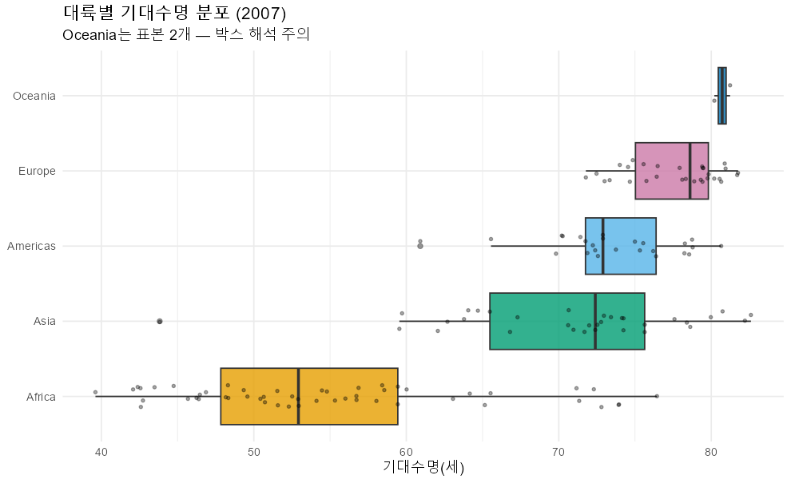

표준편차가 대륙 내 동질성을 보여준다. 유럽(2.98)은 좁고, **아프리카(9.63)·아시아(7.96)는 넓다(내부 격차 큼).** Oceania 값은 두 점만의 산물이라 괄호 처리했다.

---

## 5. 비가중 vs 인구가중 — '평균적 국가' vs '평균적 사람' (핵심 보완)

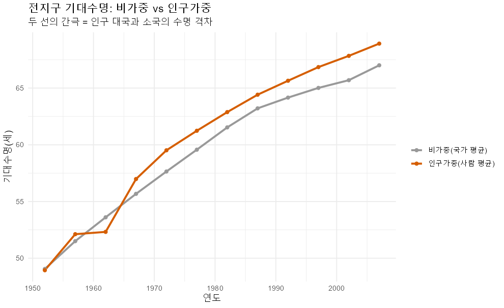

| 연도 | 비가중 평균 | 인구가중 평균 | 차이 |
|------|-------------|----------------|------|
| 1952 | 49.1 | 48.9 | **−0.1** |
| 2007 | 67.0 | 68.9 | **+1.9** |

초판이 모든 통계를 비가중(국가당 1표)으로 계산해 중국(13억)과 아이슬란드(30만)를 동급 취급한 점을 보완했다.

**발견 — 부호 역전**: 1952년에는 인구가중 < 비가중(−0.1세) → 인구 대국(중국·인도)이 평균 이하였다. 그러나 2007년에는 인구가중 > 비가중(+1.9세) → **인구 대국이 세계 평균을 추월**했다. "평균적인 사람"의 수명 개선이 "평균적인 국가"보다 빨랐다는 뜻으로, 중국·인도의 약진을 정량적으로 포착한다.

소득은 전 기간 인구가중 < 비가중 → 인구 대국이 여전히 평균보다 가난하다(아래 GDP 추세 참고).

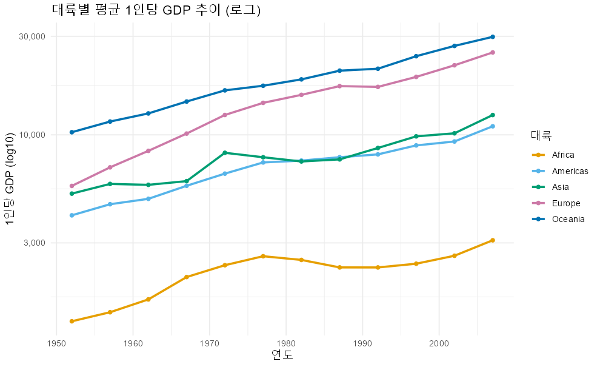

---

## 6. 수렴의 정량화 — σ-수렴 & β-수렴 (보완)

초판이 "수명은 수렴, 소득은 발산"을 *주장*만 했던 것을 두 가지 표준 지표로 측정했다.

### σ-수렴 (국가 간 분산이 줄어드는가)
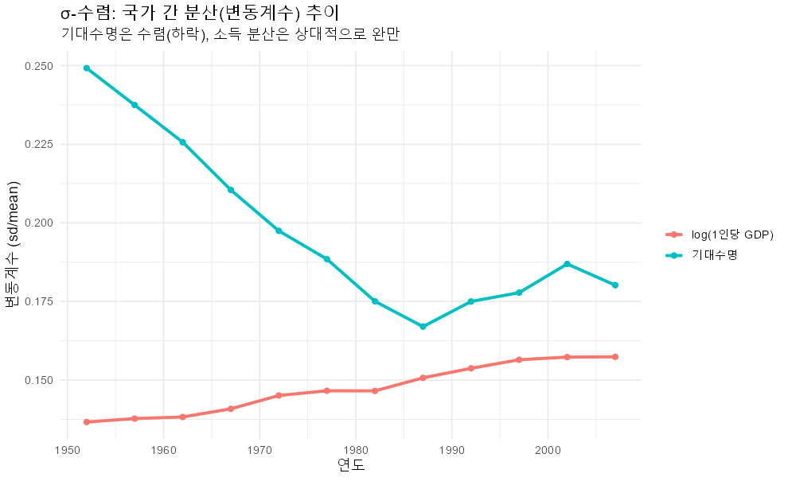

변동계수(CV = 표준편차/평균):

| 지표 | 1952 | 2007 | 판정 |
|------|------|------|------|
| 기대수명 | 0.249 | 0.180 | **수렴 (σ↓)** |
| log(1인당 GDP) | 0.137 | 0.157 | **발산 (σ↑)** |

기대수명은 국가 간 격차가 좁혀졌지만(수렴), 소득 분산은 오히려 소폭 확대(발산)됐다.

### β-수렴 (가난했던 나라가 더 빨리 따라잡는가)
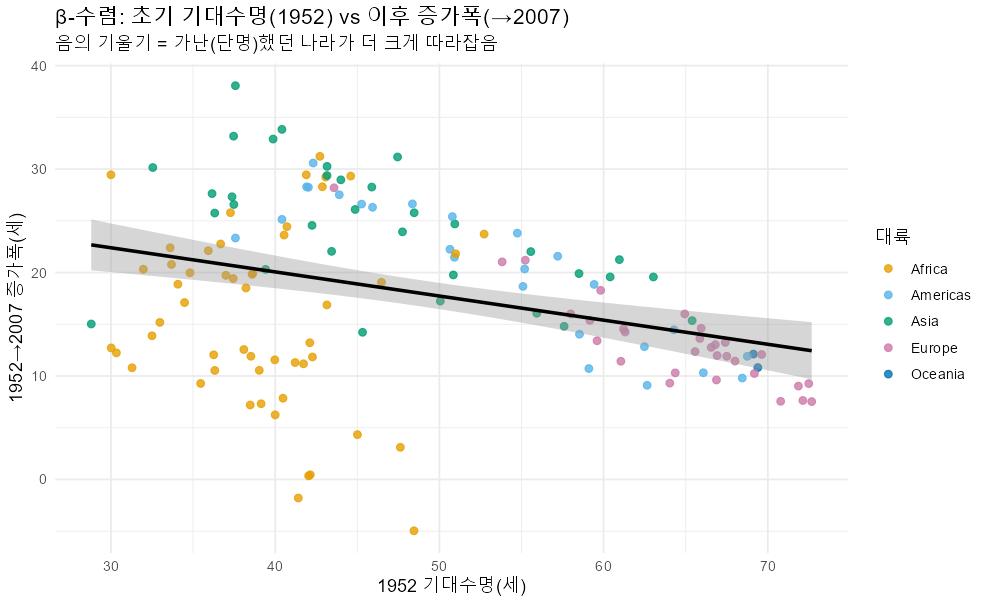

회귀: `증가폭 = 29.4 − 0.233 × (1952 기대수명)`, 기울기 **p = 1.85e-05**.
기울기가 유의하게 **음수** → 1952년에 기대수명이 낮았던 국가일수록 이후 증가폭이 컸다. **β-수렴 성립** — 출발점이 낮을수록 추격 속도가 빨랐다.

---

## 7. 기대수명 vs 소득 — 모형·상관추이·잔차 (보완)

**선형모형** `lifeExp ~ log(gdpPercap)`: **R² = 0.652**, 기울기 8.41세 / log단위.
소득이 로그 1단위(약 2.7배) 늘 때 기대수명이 평균 8.4세 증가 — 수확체감을 정량화.

### 연도별 상관추이
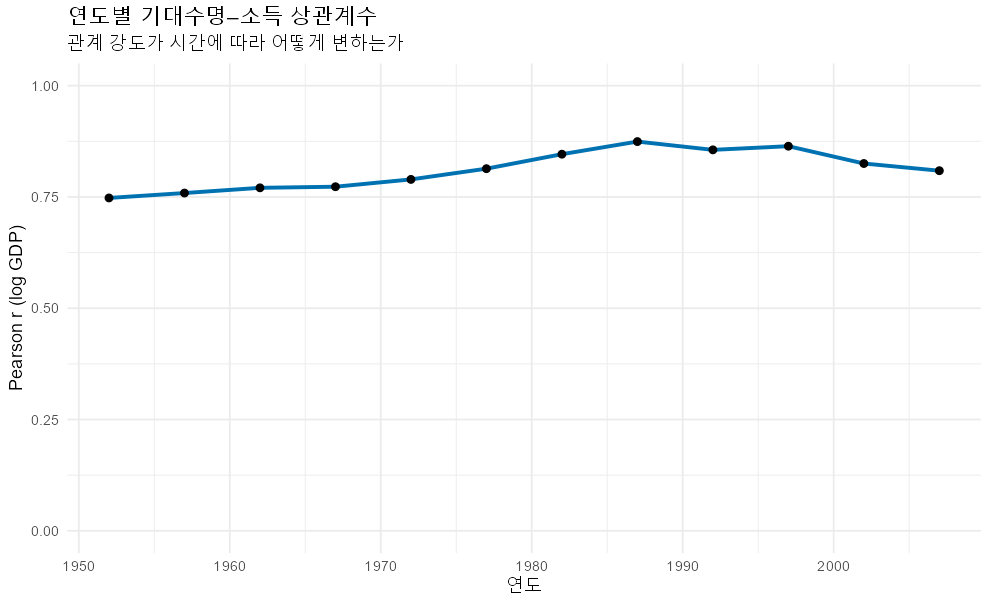

관계 강도는 0.75(1952)에서 **0.87(1987) 정점** 후 0.81(2007)로 완만히 약화. 1990년대 이후 아프리카의 에이즈 충격이 "소득이 높아도 수명이 늘지 않는" 사례를 만들어 상관을 다소 떨어뜨린 것으로 해석된다.

### 2007 버블 산점도

### 소득 대비 잔차 — 이상국가 식별 (Gapminder 핵심 인사이트)
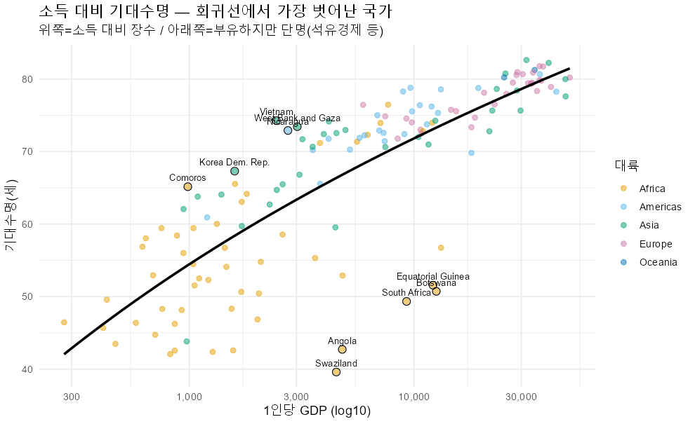

회귀선에서 가장 벗어난 국가들:

| 방향 | 국가 (잔차, 세) |
|------|------------------|
| **소득 대비 장수** (+) | Vietnam +17.8 · Comoros +16.3 · Nicaragua +15.4 · West Bank & Gaza +15.2 · Korea Dem. Rep. +14.4 |
| **부유하지만 단명** (−) | Swaziland −22.0 · Botswana −19.5 · Angola −19.4 · Equatorial Guinea −18.4 · South Africa −18.3 |

음의 잔차 그룹은 **남부 아프리카 에이즈 유행국**(스와질란드·보츠와나·남아공)과 **자원경제**(적도기니·앙골라)다. 소득만으로 수명을 설명할 수 없음을 명확히 보여준다 — 초판의 단순 IQR 이상치 카운트보다 훨씬 해석력이 높다.

---

## 8. 성장의 동조성 — 소득 성장 vs 수명 성장 (보완)

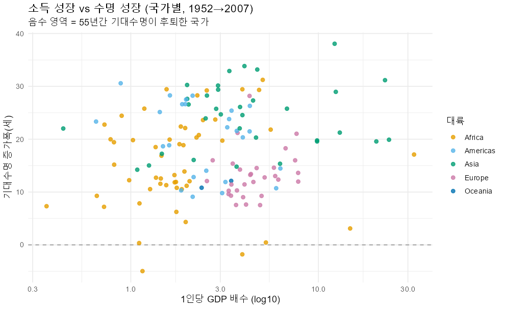

국가 단위 `cor(log 소득배수, 수명증가폭) = 0.115` — **약한 양의 관계**. 소득이 많이 늘어난 나라가 수명도 더 늘긴 했으나 연결은 느슨하다(보건·제도 등 비소득 요인의 비중).

- 최대 수명 증가: **Oman +38.1세**
- 수명 후퇴: **Zimbabwe −5.0세**

점선(y=0) 아래는 55년간 기대수명이 **후퇴**한 국가다 — 성장이 자동으로 보장되지 않음을 시각화.

---

## 9. 국가 궤적 — 후퇴국 강조 (보완)

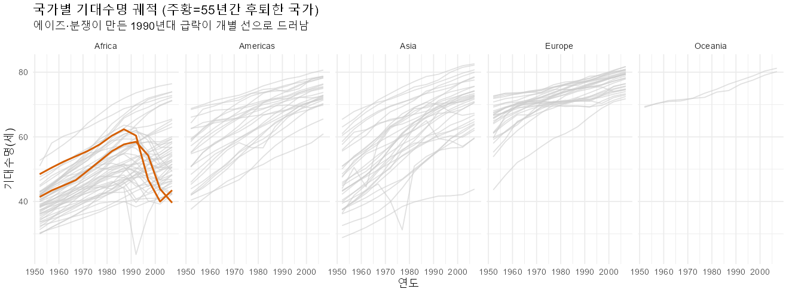

55년간 기대수명이 후퇴한 국가는 **Swaziland, Zimbabwe** 두 곳(주황색). 대부분의 국가가 우상향하는 가운데, 아프리카 패널에서 1990년대에 급락하는 개별 선들(에이즈·경제붕괴)이 평균선 이면의 충격을 드러낸다.

---

## 10. 핵심 발견 (Key Findings)

1. **분포** — `gdpPercap`·`pop`은 강한 우편향(왜도 3.85 / 8.33) → 로그·중앙값 필수. '이봉형'은 풀링 착시였다(§3).
2. **인구가중 ≠ 비가중** — '평균적 사람'의 수명이 '평균적 국가'를 2007년 추월(부호 역전). 가중 선택이 결론을 바꾼다(§5).
3. **수렴** — 기대수명은 σ·β 모두 수렴, 소득은 σ-발산. 수명은 좁혀지고 소득은 벌어진다(§6).
4. **관계** — `lifeExp ~ log(GDP)` R² ≈ 0.65, 로그형 수확체감. 강도는 1987년 정점 후 완만히 약화(§7).
5. **잔차** — 부유하지만 단명한 에이즈·자원국 vs 소득 대비 장수국이 명확히 분리. 소득은 강력하나 충분조건이 아니다(§7).
6. **후퇴국** — 소수(스와질란드·짐바브웨)지만 존재. 성장은 자동 보장이 아니다(§8–9).

---

## 부록 — 산출 차트 목록 (figures/)

| # | 파일 | 설명 |
|---|------|------|
| 01 | [`01_hist_lifeExp.png`](../figures/01_hist_lifeExp.png) | 기대수명 히스토그램 |
| 02 | [`02_hist_gdp_log.png`](../figures/02_hist_gdp_log.png) | GDP 분포(로그) |
| 03 | [`03_density_lifeExp_byyear.png`](../figures/03_density_lifeExp_byyear.png) | 연도별 분포 이동 |
| 04 | [`04_box_lifeExp_2007.png`](../figures/04_box_lifeExp_2007.png) | 대륙별 박스플롯 |
| 05 | [`05_weighted_vs_unweighted.png`](../figures/05_weighted_vs_unweighted.png) | 비가중 vs 인구가중 |
| 06 | [`06_trend_gdp.png`](../figures/06_trend_gdp.png) | 대륙별 GDP 추세 |
| 07 | [`07_sigma_convergence.png`](../figures/07_sigma_convergence.png) | σ-수렴 |
| 08 | [`08_beta_convergence.png`](../figures/08_beta_convergence.png) | β-수렴 |
| 09 | [`09_corr_by_year.png`](../figures/09_corr_by_year.png) | 연도별 상관추이 |
| 10 | [`10_scatter_2007.png`](../figures/10_scatter_2007.png) | 2007 버블 산점도 |
| 11 | [`11_residual_outliers.png`](../figures/11_residual_outliers.png) | 소득 대비 잔차 이상국가 |
| 12 | [`12_growth_coupling.png`](../figures/12_growth_coupling.png) | 성장 동조성 |
| 13 | [`13_facet_decliners.png`](../figures/13_facet_decliners.png) | 국가 궤적(후퇴국 강조) |

---

*본 보고서는 개정된 `EDA.R` 실행 결과(콘솔 통계 + figures/ 차트 13종)를 종합한 것이다. 별도 명시가 없으면 통계는 비가중 국가 평균 기준이며, §5에서 인구가중과 비교한다. 재현 환경은 `figures/session_info.txt` 참조.*
